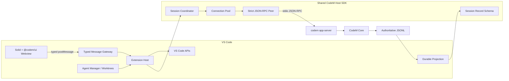

# 基于 CodeM App Server 与 Kilo Code 的 VS Code 插件方案

版本：v1.4　更新日期：2026-09-18　状态：主聊天已接 App Server；VS Code 不再启动 kilo serve；36 个 Core v1 协议缺口已从命令面产品砍掉；mature UI 生产门禁为绿。Agent Manager / leftover-sdk / JetBrains 仍在，不得宣称整个扩展已切完。

v1.3 核对摘要：以仓库现码与 `matureUiParityReport()` 为准。当前 Webview 入站命令 **241** 项：199 项归属编辑器 Host 或独立服务，**42** 项归属 App Server 且全部有严格控制器，**0** 项协议缺口。`assertMatureUiProductionReady()` 通过。扩展源码版本 `0.1.14`，`@codem/app-server` `0.1.6`，pin 仍是 CLI `0.1.208` / Core `0.8.37`。JetBrains 尚未消费该包。

v1.1 仍是 2026-09-15 的契约来源说明：CodeM `main@d7763f0a`、共享 Host 覆盖连接池 / thread / turn / history / HITL / mode / control / skills / side question / 工具流 / guard / 完整 diff / 结构化 final answer / 后台唤醒 / hook / 受控关闭，以及“全部真实能力接通后才原子删除 Kilo、不保留 fallback”。这些目标未变；变的是接入进度。

# 0. 当前接入状态（2026-09-18）

这是现状，不是目标架构。产品不变量仍要求单一 App Server live transport。

| 边界 | 现状 | 缺口 |
| --- | --- | --- |
| 共享 Host SDK | `packages/app-server` 已拥有 runtime、bundle、preflight、RPC、按 **canonical `cwd`** 分的连接池、thread/turn、HITL、mode、space broker、受控关闭。无 Electron / VS Code / DOM 依赖。 | Desktop 尚未改为消费该包。`CODEM_SESSION_SOURCE` 仍硬编码 `vscode`。 |
| 持久化历史 | `@codem/session-history` 读 Core JSONL schema 13；无第二套 transcript store。`thread/turns/list` 与 `thread/items/list` 只作为 live snapshot，不是公开历史源。 | 无持久 SQLite 索引；每次全量流式 replay。 |
| VS Code 主聊天 | `CodeMAppServerService` + `MatureUiAppServerController` 承接 42 个控制器命令。模式是 **UI 适配 App Server**：Host 直接 post `codemModelsLoaded` / `codemSkillsLoaded` / `threadModes*` 与 CodeM 控制面结果。`requestCommands` 与 `requestSkills` 写同一份 Skills DTO，斜杠不再读 `commandsLoaded`。rewind / archive / unarchive / clearThread / hooks / plugins / tools / env 白名单 / config 去密钥快照 / permission profiles / modelProvider capabilities / backgroundTerminals / runShell（校验归属）/ cancelSideQuestion / Core space 快照 / live turns·items / last-known live usage 已接。 | 未发明 Settings/MCP/sandbox 页。刻意不接：用 `space/list` 替换 broker 写路径、用 `turns/items/list` 当 JSONL 历史、`clearSession` 当 `thread/clear`、把 `backgroundTerminals.processId` 混进 `requestBackgroundJobs.taskId`。Kilo-only 命令（MCP 写入、provider OAuth、memory、indexing、sandbox、message-scoped revert/delete、suggestions、Kilo config write）已从 `WebviewMessage` 产品砍掉。 |
| 认证与 space | 登录/注册/退出/刷新走 CLI credential broker。`codem.selectSpace` 走 broker `project_list` / `space_prepare` / `space_commit`。Workspace Trust 在启动 Core 前检查。 | `setOrganization` 仍走 Kilo handler。 |
| Kilo transport | 激活仍创建 `KiloConnectionService`，但 `connect()` / `ServerManager.getServer()` fail closed，不再 spawn `kilo serve`。Autocomplete / commit message / Agent Manager 等未迁移表面报 `尚未迁移到 CodeM App Server`。Webview 与 Host 生产源码不再 import `@kilocode/sdk`；时间线类型走 `@codem/ui/types/session`。Leftover `KiloClient` 类型与 fail-closed `createKiloClient` 住在 `leftover-sdk.ts`。 | leftover 单测与 `package.json` 仍声明 `@kilocode/sdk`；`packages/opencode` 尚未删除。 |
| 路由泄漏 | `handleAppServerMessage` 对 `app-server-live` 与 `app-server-control` 均 fail closed，不再落到 Kilo。产品砍掉的 leftover Host 方法（config write/memory/indexing/sandbox/revert/delete/provider OAuth/MCP mutation）已从 `CodeMProvider` 删除。 | leftover-sdk、Agent Manager、autocomplete 仍在。 |
| 门禁 | 241 = 199 + 42 + 0 pending + 0 gaps；`ready: true`。 | mature UI 命令面已切。Agent Manager / leftover-sdk / JetBrains 仍在，不得宣称整个扩展生产可切。 |

### 已接 / 刻意未接（Host 控制面 Cycle）

| 状态 | RPC / 消息 | 说明 |
| --- | --- | --- |
| 已接 | `thread/rewind/start` → `rewindThread` / `rewindThreadResult` | TaskHeader + `/rewind`。不是 `revertSession`。 |
| 已接 | `thread/archive` / `thread/unarchive` → `archiveThread` / `unarchiveThread` | SessionList 按钮。 |
| 已接 | `thread/clear` → `clearThread` / `clearThreadResult` | 控制器 + 测试。不是 `clearSession`。 |
| 已接 | `thread/loaded/list` → `requestLoadedThreadIds` | 仅 threadId。 |
| 已接 | `hooks/list` / `plugin/list` / `tools/list` | 白名单 DTO，无独立页面。 |
| 已接 | `environment/info` → `requestEnvironmentInfo` | 只拷 agentName/version/os/arch。 |
| 已接 | `config/read` → `requestConfigSnapshot` | 去密钥快照。不是 `requestConfig`。 |
| 已接 | `permissionProfile/list` → `requestPermissionProfiles` | 现有选择器过滤 default/auto/yolo + settableAtRuntime。 |
| 已接 | `modelProvider/capabilities/read` | 布尔能力位。 |
| 已接 | `backgroundTerminals/*` | 独立消息，`processId ≠ taskId`。 |
| 已接 | `shell/run` → `runShellCommand` | 必须已加载线程。 |
| 已接 | `thread/sideQuestion/cancel` → `cancelSideQuestion` | 增强提示词再点一次取消。本 Cycle 不重做。 |
| 已接 | `space/list` → `requestCoreSpaceSnapshot` / `coreSpaceSnapshotLoaded` | Core 空注入快照。不是 CLI broker / `project_list`。状态栏选择器仍走 broker 写路径。 |
| 已接 | `thread/turns/list` / `thread/items/list` → `liveThreadTurnsLoaded` / `liveThreadItemsLoaded` | 实时快照。不是 JSONL 历史；`loadMessages` 仍只读 `@codem/session-history`。 |
| 已接 | `requestSessionModelUsage` → `liveThreadUsageLoaded` | last-known `thread/tokenUsage/updated`。非耐久，不发明 Kilo models/cost。 |
| 产品砍掉 | `requestConfig` / `updateConfig` / MCP 写入 / provider OAuth / memory / indexing / sandbox / message-scoped revert·delete / suggestions / agents catalog / image models | Core v1 无对应 RPC。命令已从 WebviewMessage 与 ownership 表删除；Settings 相关入口隐藏。 |
| 刻意未接 | Settings / MCP / sandbox 完整页 | 不发明 Core 没有的页面。 |
| 验证 | 2026-09-17：本 Cycle 接 Core space 快照、live turns/items、last-known usage。`pnpm test:protocol` 6、`typecheck:protocol`、`pnpm test:app-server` 81、`typecheck:app-server`、host App Server 单测 79、`check-types:webview` 通过。Host `check-types` 仍只有既有 TS6059（src 引用 webview 类型，rootDir 不含 webview-ui）。 | 非 darwin 目标未做 clean-host。默认 `pnpm test:vscode` 另含一条既有 `app-server-text-render` 渲染用例。 |

# 1. 结论与推荐路线

**推荐采用“CodeM 单一运行时 + Kilo 交互选择性复用 + `@codem/ui` Solid 组件”的路线。**插件位于 `apps/vscode`，复用 Kilo 已验证的 Activity Bar、Sidebar/Open in Tab、上下文引用、diff/review、历史导出、后台子 Agent 和 Agent Manager 交互设计，但不把 Kilo backend 当作目标依赖。Webview 使用 Solid 与仓库自有的 `packages/ui`（`@codem/ui/components/*`）；唯一 agent 后端是 `codem app-server` stdio JSON-RPC，Core JSONL 是持久化会话权威。

该路线不是长期维护两套运行时。目录 / 模式面（模型表、Skills、thread modes）由 Extension 直接 post CodeM 原生 DTO，UI 适配 App Server，不再把 Host 控制面收成 Kilo `providersLoaded` / `commandsLoaded` / `agentsLoaded`。会话时间线仍允许一个有明确退出条件的 presentation adapter，把 turn/part DTO 映射为现有 message/part 词汇；它不读取 raw frame、不拥有 durable history、也不在 App Server 失败时回退 Kilo。第一阶段把 App Server host、会话契约和事件投影收敛成可复用包；第二阶段让现有完整 VS Code 表层逐项接到该 SDK；第三阶段一次性切换生产 agent transport 并删除兼容层。

CodeM `main@d7763f0a` 已包含正式 App Server Desktop 实现与 active contract；本仓库不再以旧集成分支作为当前行为依据。线上 CLI `0.1.208` 与 Core `0.8.37` 仍是本 Cycle 的精确制品 pin。VS Code Sidebar 已把控制器就绪的主聊天接到 App Server，并且不再启动 `kilo serve`。mature UI 命令面生产门禁已绿（241 / 42 / 0）。在 leftover-sdk、Agent Manager、autocomplete 与 JetBrains 消费者删除之前，不得宣称整个扩展生产调用链已切换，完成后也不保留 Kilo transport 作为 fallback。

# 2. 已验证的当前事实

## 2.1 CodeM App Server

| 事实       | 已验证状态                                                                                                                                                                     | 对 VS Code 的影响                                                                          |
| ---------- | ------------------------------------------------------------------------------------------------------------------------------------------------------------------------------ | ------------------------------------------------------------------------------------------ |
| 代码位置   | App Server 的当前依据是 `byted/main@d7763f0af4a9152e9dd4ca54ce6f1e56862b798c`，包含 `src/main/codem/app-server/*` 与 active Desktop contract。                                 | VS Code 与 Desktop 以同一主干契约收敛；旧集成分支只保留历史来源意义。                      |
| 实时协议   | 线上 Core `0.8.37` 提供换行分隔的 App Server stdio，接受带 `jsonrpc: "2.0"` 的请求；当前响应省略该字段，其余 `id/result/error`、protocol 与 capability 形状可用。              | Host 临时接受并记录“省略”或精确 `"2.0"`，拒绝其他值；不降级到 Kilo/Headless。              |
| 持久化     | Core JSONL schema 13 是 durable history 权威。本仓库由 `@codem/session-history` 流式 replay，不维护 SQLite 会话库。Desktop 侧 SQLite/窗口数据仍只能是可重建投影。                | VS Code 不另造会话数据库；历史只读 JSONL，失败显式报错。                       |
| 连接模型   | 本仓库 Host 连接池键为规范化绝对 `cwd`；permission mode 是 thread 级 `thread/mode/*` 状态，不拆第二个 Core 进程。同一连接可承载多个 thread，以 `threadId` 路由。               | 连接属于 Extension Host，不属于某个 Webview 或标签页。                                     |
| 协议能力   | 覆盖 start/resume、turn start/steer/interrupt、compact、rewind、权限、问题、计划、Plan Mode、后台任务、side question、diff、rename/archive/delete/fork 与 skills。             | MVP 可以覆盖完整 agent 交互，而无需借用 Kilo agent runtime。                               |
| 运行时版本 | 2026-09-15 registry latest CLI 为 `0.1.208`，声明 Core `0.8.37`；当前 CodeM 源码 `main` 的旧 pin 不再作为 VS Code runtime 权威。                                               | Host 精确固定线上 Core `0.8.37`；升级只能作为独立 Cycle，禁止隐式跟随 latest。             |
| 初始化认证 | Core binary 不提供 `auth` 子命令；CLI `0.1.208` 提供机器可读的 `auth status/login/logout`，登录授权页同时支持新用户注册。                                                      | VSIX 必须携带匹配平台的 CLI broker；Host 不直接接触 refresh token 或私有 config。          |
| 平台包     | 线上 Core `0.8.37` 发布 macOS、Linux、Windows 的 arm64/x64 六个平台包。                                                                                                        | Host 可解析全部六种目标；当前只在 macOS arm64 完成真实执行，其他目标仍需 clean-host 验收。 |
| 验收       | 2026-09-18：mature UI 命令面 241 = 199 + 42 + 0 gaps，`assertMatureUiProductionReady()` 通过。`@codem/app-server` 81 项契约测试与 typecheck 通过；VS Code host App Server 单测覆盖 rewind/archive/clear/env/config snapshot/terminals/shell、Core space 快照、live turns/items 与 last-known usage。darwin-arm64 已用已登录 credential broker 跑通受信工作区 live turn + HITL + JSONL reload。 | leftover-sdk / Agent Manager / JetBrains 仍在。非 darwin clean-host 仍未做。      |

## 2.2 Kilo Code

本方案更新为基于 2026-09-11 的 Kilo Code 官方主干 `c36e2263`，VS Code 包版本为 `7.6.2`，最低 VS Code API 仍为 `^1.105.1`。其插件使用一个 Extension Host 级 `KiloConnectionService`，按需启动 `kilo serve --port 0`，再通过 HTTP REST + SSE 和自动生成 SDK 通信；Sidebar、Open in Tab、后台子 Agent 面板与 Agent Manager 共享该连接。

Kilo Webview 使用 Solid.js；本仓库已把共享控件迁到 `@codem/ui`。Extension 与 Webview 通过 `postMessage` 通信。当前 `CodeMProvider.ts` 为 5745 行，Webview 源文件约 335 个，Agent Manager 源文件约 110 个；其可用表层已扩展到 JSONC 配置、细粒度权限、自定义 Agent、Skills、Workflows、后台子 Agent、图表、会话导出、上下文引用、PR 导入和多模型对比，但这些能力仍通过 Kilo Session 与共享 REST/SSE runtime 路由。这说明 UI/Host 与 Kilo 后端耦合较深，不适合保留现有 Provider 后只替换 URL。

Kilo Code 使用 MIT License，允许商业使用、修改与分发，但复制或实质性复用时必须保留 Kilo Code 与 opencode 的版权及许可声明。MIT 授权不等于商标授权，Kilo 名称、图标、服务端点和品牌资产应从新插件中移除。

# 3. 产品目标与业务不变量

## 3.1 Outcome

用户在 VS Code 内可以使用与 CodeM Desktop 同源的 agent 会话：创建或恢复 thread、发送文本与附件、查看流式 reasoning/message/tool/todo/diff、处理权限与提问、停止或 steer 当前 turn，并在 IDE 重启后恢复同一 durable history。插件的外观与 IDE 集成借鉴 Kilo，但会话语义、身份、持久化和失败行为与 CodeM App Server 保持一致。

## 3.2 业务不变量

- Core 分配并拥有 `threadId`；Extension 和 Webview 不生成替代会话 ID。
- Core JSONL 是唯一 durable conversation source；SQLite、Webview store 与 VS Code state 都只能是可重建投影或界面偏好。
- 一个产品版本只有一个 agent live transport：App Server。不得保留 Kilo REST/SSE、旧 Headless SSE 或 silent fallback。
- Extension Host 是进程、认证、文件系统与 VS Code API 的边界；Webview 永远不接触 token、运行时环境变量、任意本地路径或 child process。
- 所有通知和 client request 必须同时按 connection identity、`threadId`、`turnId`、`requestId`／`submissionId` 关联；重复、过期或未知消息不得改变另一会话。
- `turn/completed` 是 live terminal 权威；durable ingest 可以稍后完成，但不能让已结束的 UI run 继续显示运行中。
- 未受信任工作区不启动 App Server、不执行工具、不读取工作区内容；用户建立信任后才允许创建连接。
- 协议版本或必需 capability 不匹配时 fail closed，并显示可定位的版本与缺失能力，不得降级到另一后端。
- 同一 connection key 下的多个 Webview 共享一个运行时连接；关闭一个面板不得结束其他 thread。

## 3.3 状态所有权

| 状态                         | 权威所有者                         | 规则                                                                          |
| ---------------------------- | ---------------------------------- | ----------------------------------------------------------------------------- |
| Thread、turn、工具与交互记录 | CodeM Core JSONL                   | 插件只读取、投影和展示，不另写兼容记录。                                      |
| Live connection 与待处理 RPC | Extension Host                     | 进程内临时状态；重启后通过 resume + durable projection 重建。                 |
| 历史索引与窗口缓存           | Extension Host 的可重建 projection | 存放在 extension globalStorage；损坏时删除并从 JSONL 重建。                   |
| 认证秘密                     | CodeM CLI credential broker        | Host 只消费公开 status/login/logout；不得进入 Webview、日志或 VS Code state。 |
| 界面偏好、最近打开与 pin     | VS Code globalState/workspaceState | 不能反向定义 Core thread 的存在性或终态。                                     |
| Agent Manager 工作树映射     | 工作区内显式 CodeM 配置            | 仅保存 project/worktree/session 关联；thread 状态仍由 Core 拥有。             |

# 4. 路线选择

| 路线                                             | 收益                                                                                                                | 代价与风险                                                                                                                        | 结论                 |
| ------------------------------------------------ | ------------------------------------------------------------------------------------------------------------------- | --------------------------------------------------------------------------------------------------------------------------------- | -------------------- |
| 完整 fork Kilo monorepo，再替换后端              | 最快得到可运行的 Kilo UI、Agent Manager 与发布脚本。                                                                | 保留大量 Kilo gateway、SDK、provider、autocomplete 与 workspace 包；上游 merge 会反复把被删除的会话模型带回，长期存在双权威风险。 | 不推荐作为目标架构。 |
| 在 CodeM monorepo 中选择性抽取 Kilo VS Code 表层 | 能复用成熟 IDE 交互，同时让 Desktop 与 VS Code 共用 App Server host、session contract 和 projection；目标模型单一。 | 首期需要拆解 CodeMProvider 和工作区依赖，UI 搬运速度略慢。                                                                         | **推荐。**           |
| 从空白 VS Code 插件开始                          | 依赖最少、代码完全自有。                                                                                            | 会重复建设 Webview、主题、diff、文件引用、工作树、可访问性和发布验证，无法发挥 Kilo 代码价值。                                    | 只适合极小 PoC。     |

**推荐实施形态。**在 CodeM 仓库新增 `apps/vscode`，以 Kilo 官方 commit `c36e2263` 作为一次性上游基线，按文件记录来源；复用内容进入自有模块后立即改成 CodeM 命名与 DTO。后续不做整仓 merge，只按明确需求选择性移植上游修复，并通过 `UPSTREAM.md` 记录来源 commit、变更文件、许可证和本地替代模块。

**禁止的过渡形态。**不得让 Webview 同时认识 Kilo Session 与 CodeM Thread，不得用可选字段把两种事件塞进一个 union，不得同时启动 `kilo serve` 和 `codem app-server`，也不得保留“App Server 失败就退回 Kilo/Headless”的分支。

# 5. 目标架构



## 5.1 分层职责

**VS Code Extension Shell。**负责激活、命令注册、Activity Bar/Webview、编辑器导航、文件选择、终端上下文、Workspace Trust、SecretStorage、Output Channel 与 VSIX 生命周期。该层可参考 Kilo 的 Extension/Webview 组织方式，但不能包含 agent 状态机。

**CodeM Host SDK。**从冻结集成分支的 `src/main/codem/app-server`、`engine-port`、session record 和 projection 中收敛 Node 可用、无 Electron 依赖的共享包。它负责运行时解析、进程启动、initialize/capability preflight、严格 JSON-RPC、连接池、thread/turn 生命周期、server request、durable ingest 与 typed event。App Server 进入目标发布树时，Desktop 必须改为使用同一 SDK，避免 VS Code 复制协议实现后漂移。

**Webview Message Gateway。**Extension 与 Webview 双向消息都使用 discriminated union + strict schema。Webview 只看到产品 DTO，例如 `ThreadSummary`、`TimelineItem`、`PendingInteraction`、`RunStatus`；它不看到 App Server raw frame、Core 文件路径或 Kilo SDK 类型。

**Durable Projection。**读取 Core JSONL schema 13，生成可重建历史索引与窗口。索引存放在 VS Code `globalStorageUri` 下并按 profile/workspace identity 隔离；删除索引后可完整重建。Extension 不实现第二套 JSONL parser。

## 5.2 连接与隔离

一个 Extension Host 维护一个 `AppServerHost`；连接池以规范化绝对 `cwd` 为键。permission mode 随 thread 走 `thread/mode/read|set`，不按 mode 再拆进程。Sidebar、编辑器标签页和同一工作树内的多个 thread 共享连接；不同 cwd 使用不同 App Server 进程。Agent Manager 的每个 worktree 因 cwd 不同自然进入不同连接，避免跨工作树工具执行。

运行时版本、profileHome、stateRoot、sessions root 与认证 broker 在 Extension Host 启动时一次确定，不得由 Webview 或工作区文件覆盖。App Server initialize 必须验证 protocol version 与 required capabilities，任何缺失都在创建 thread 前失败。

# 6. 状态、身份与生命周期模型

## 6.1 合法状态

每个可见会话由 `ThreadIdentity = { profileId, canonicalCwd, threadId }` 唯一标识；每次提交由 `submissionId` 标识，运行由 App Server 返回的 `turnId` 标识。Webview 的状态只允许 `idle → preparing → accepted/running → terminal`，或 `preparing → rejected`。没有 threadId 的草稿不是会话，未收到接受结果的提交不是已提交 turn。

## 6.2 提交、失败与重试

| 阶段                      | 规则                                                                                                                                                                  | 用户可见结果                                        |
| ------------------------- | --------------------------------------------------------------------------------------------------------------------------------------------------------------------- | --------------------------------------------------- |
| 启动前                    | 工作区信任、运行时、认证、protocol/capability 任一失败时不得创建 thread 或写入 UI history。                                                                           | 保留 composer 内容，显示可定位错误与修复入口。      |
| `thread/start`／resume 前 | Core 返回的 threadId 是唯一身份；Extension 不预建 client UUID 会话。                                                                                                  | 准备中可以取消；失败后历史列表不出现 ghost thread。 |
| `turn/start` 请求中       | Webview 可显示“正在提交”的临时项，但只有 App Server 接受精确 submission/turn identity 后才提交 running 状态并清空 composer。                                          | 请求被拒绝时恢复原输入，不能伪装成已发送消息。      |
| 可能已提交但 ACK 丢失     | 禁止盲目重发。先按 submissionId 与 durable/live 状态对账；能证明已接受则绑定原 turn，能证明未接受才允许重试，无法判定则显示 unknown outcome 并要求 resume/reconcile。 | 不会产生重复用户消息或重复工具执行。                |
| live terminal             | `turn/completed` 或唯一 failure terminal 立即结束 UI run；durable ingest 超时只影响历史收敛，不反转终态。                                                             | 停止、失败、完成保持不同状态。                      |
| 权限/提问/计划            | 按 requestId + turnId 关联，最多回答一次；unknown、duplicate、stale 请求安全拒绝。client request resolution 失败必须终止对应 turn。                                   | 交互卡不会串到另一会话，也不会无限 pending。        |
| 进程崩溃                  | 连接上的所有 active run 进入 protocol failure terminal；清理 pending RPC。下一次用户显式操作可重建连接并 resume，但不自动重放未确认提交。                             | 显示受影响 thread 与 stderr 摘要，不吞错。          |

## 6.3 生命周期

插件激活时只注册命令和视图，不启动 Core。首次打开会话或执行预检时懒启动 App Server。关闭单个 Webview 仅解除订阅；最后一个 thread 释放时可保持短期复用，Extension deactivate 时按“interrupt active turn → thread/unsubscribe → close peer → 有界强杀”顺序清理。强杀只是无响应进程的最终清理路径，不能替代正常 unsubscribe。

VS Code reload 后，Extension 从 profile/session root 重建 catalog 和 projection；打开历史 thread 时执行 `thread/resume`，不得依赖上次 Webview 序列化的运行状态。任何在 reload 前未确认的提交都先对账，不能自动重发。

# 7. Kilo Code 能力与复用边界

下表中的“直接复用”仍要求完成 CodeM 命名、DTO、路径校验、许可与品牌处理，不表示按目录原样复制。优先级表示进入 CodeM VS Code 路线的顺序，而不是 Kilo 功能质量评价。

| 优先级 | Kilo 当前可用能力                                                                                                                                 | 处理方式                            | CodeM 目标与边界                                                                                                                                  |
| ------ | ------------------------------------------------------------------------------------------------------------------------------------------------- | ----------------------------------- | ------------------------------------------------------------------------------------------------------------------------------------------------- |
| P0     | Extension 激活、Activity Bar、Sidebar、Open in Tab、View/Command 注册、Webview CSP                                                                | 直接复用框架并改名                  | 保留 VS Code 生命周期、nonce、localResourceRoots、Output Channel 和多 surface 模式；使用新的 publisher、view ID 与 command prefix。               |
| P0     | Kilo Webview 的信息架构、主题适配、Markdown、状态、表单、对话框、图表和可访问性行为                                                               | 迁入 `@codem/ui` Solid 组件 | Webview 只消费 CodeM Product DTO，通过 `@codem/ui/components/*` 渲染，不引用 Kilo SDK 类型。                                         |
| P0     | 文件/目录拖放与 mention、当前文件和打开标签页、终端、Git Changes、历史会话、图片、编辑器 Code Actions                                             | 优先复用                            | Extension Host 解析并校验 URI、工作区和 worktree identity，再转成 CodeM text/file/image/directory attachment 或显式上下文。                       |
| P0     | Diff/review 面板、修改摘要、编辑器 side-by-side diff、review annotation、snapshot 回退入口                                                        | 复用表层，替换状态来源              | Diff 来自 App Server file-change/JSONL projection；回退只调用 CodeM rewind，不创建 Kilo snapshot 权威或第二份会话状态。                           |
| P0     | 会话列表、搜索、恢复、改名、归档、删除、Markdown transcript export                                                                                | 复用交互和导出表层                  | 列表与正文来自 Core thread/control port 和 shared projection；VS Code state 只保存 UI 偏好。                                                      |
| P0     | permission、question、plan 与运行状态交互卡                                                                                                       | 只复用展示组件                      | 请求身份、可选动作、回答提交和失败语义完全来自 App Server typed request；不得沿用 Kilo permission store。                                         |
| P1     | 后台子 Agent 状态条、取消、Needs input 和只读 Sub-Agent Viewer                                                                                    | 适配后复用                          | 仅在 CodeM 提供稳定 parent/child identity、状态和 transcript 契约后接入；子请求仍按 threadId/turnId/requestId 隔离。                              |
| P1     | Agent Manager：并行 session、Local/worktree、独立终端、diff/review、setup script、`.env` 复制、现有 branch/worktree/PR 导入、Continue in Worktree | 第二阶段重点复用                    | 复用 VS Code/Git/worktree orchestration 与布局；Kilo Session、`.kilo` 状态和 `kilo serve` 路由全部替换为 CodeM project/worktree/thread identity。 |
| P1     | JSONC 设置、自定义 Agent、细粒度工具权限、Workflows、Skills 管理                                                                                  | 复用信息架构或组件，不复用配置协议  | CodeM Core/企业管理后台仍是 Agent、Skill 与权限权威；只有已确认的本地 UI 偏好进入 VS Code 配置。                                                  |
| P1     | MCP 设置、Marketplace 浏览、Playwright 浏览器自动化                                                                                               | 只复用通用 UI 模式                  | 实际 MCP、Browser 与工具目录由 CodeM Core/Plugin 提供；不启动 Kilo MCP 或浏览器 backend。                                                         |
| P2     | Autocomplete/Ghost Text、状态栏和费用显示                                                                                                         | 暂不复用                            | 当前依赖 Kilo Gateway 与专用 FIM 模型；App Server 没有等价低延迟协议，必须单独立项，不能伪装成 agent turn。                                       |
| 不复用 | `KiloConnectionService`、ServerManager、`@kilocode/sdk`、REST、SSE adapter                                                                        | 删除并替换                          | 使用共享 CodeM RuntimeManager + AppServerConnectionPool；stdio JSON-RPC，不开放 Kilo 本地 HTTP 服务。                                             |
| 不复用 | Kilo Session/message/store、Gateway、登录、余额、团队、provider 和 Cloud Agent/Cloud Review                                                       | 删除                                | Core JSONL、CodeM 认证、模型与组织策略是唯一权威；未来云能力必须独立定义产品契约。                                                                |
| 不复用 | Kilo telemetry、名称、图标、URL 与服务端点                                                                                                        | 删除                                | 使用 CodeM 自有遥测与品牌；保留代码来源、MIT License 和第三方通知。                                                                               |

迁移以“生产代码不再依赖 Kilo 后端与领域类型”为准出条件，而不是把旧类型改成 optional。对于当前 5745 行的 `CodeMProvider.ts`，应先按 View Host、Thread Controller、Workspace Adapter、Interaction Presenter 与 Settings Bridge 拆出无 Kilo backend 依赖的表层，再接 CodeM Host SDK；不能整体复制后堆叠 transport 条件分支。

# 8. MVP 范围与非目标

## 8.1 首个可用版本（内部 VSIX）

- macOS arm64/x64、Windows x64 的 target-specific VSIX；首次启动进行 Core 版本与 capability preflight。
- 单工作区 folder：Sidebar 与 Open in Tab、新建、恢复、历史列表、搜索、改名、归档、恢复、删除与 Markdown transcript export。
- 文本、图片、文件和目录附件；文件/目录拖放、当前文件、打开标签页、当前选区、终端和 Git Changes 由用户显式加入或按已声明规则附带。
- 流式 assistant/reasoning、tool、todo、usage、diff、warning 与唯一 terminal 展示。
- stop、soft steer、compact、rewind；model、intelligence、permission 与 interaction mode。
- permission、user question、plan approval、Plan Mode 与后台任务取消。
- diff/review 打开、文件定位、工作区链接安全跳转、Code Actions；Extension reload 后恢复 durable history。
- Workspace Trust、SecretStorage、CSP、Output Channel、诊断导出和无敏感信息日志。

## 8.2 第二阶段

- 后台子 Agent 状态条、取消、Needs input 与只读 transcript viewer。
- Agent Manager：并行 Local/worktree session、多标签、工作树创建、setup script、`.env` 复制、每会话终端、diff/review、branch/worktree/PR 导入和 Continue in Worktree。
- 多根工作区与 project registry；明确 project/worktree/thread 路由。
- skills 菜单、MCP 管理和 CodeM Browser 交互的 IDE 表层。
- Open VSX／Marketplace 发布、自动更新、组织策略与管理员配置。
- Linux、Remote SSH、Dev Container、WSL；线上 Core 平台包已存在，但必须先完成 clean-host 与 Remote Extension Host 验收。

## 8.3 非目标

首期不迁移 Kilo Cloud、Kilo Gateway、provider 计费、远程 Kilo server、Kilo plugin marketplace、Kilo session 导入、autocomplete、JetBrains 插件，也不在 VS Code 内复制 CodeM Desktop 的完整项目导航和自动更新系统。浏览器、MCP、Skills 若由 Core 提供，只做 IDE 入口，不复制 Kilo 后端。

# 9. 代码组织与依赖边界

```text
codem/
  apps/
    vscode/
      src/extension.ts        # activation；同时创建 App Server 与遗留 Kilo 连接
      src/services/app-server/  # VS Code Host adapter、成熟 UI controller、241 项 ownership
      src/services/cli-backend/ # 遗留 Kilo serve / REST / SSE；迁移源，不是目标
      webview-ui/             # Solid Webview；只应消费 product DTO 与 @codem/ui
      src/agent-manager/      # worktree orchestration；agent 会话仍待切离 Kilo
      tests/host/             # 默认 App Server host 单测
      tests/extension-host/   # 真机验收（需已登录）
      package.json
    jetbrains/                # 原生 IntelliJ UI；尚未引用 @codem/app-server
  packages/
    ui/                       # Solid 组件源码与 tokens（@codem/ui）
    app-server/               # Core runtime、staging、integrity、RPC、Host lifecycle
    session-history/          # JSONL schema 13 durable history；无独立 session/cli-adapter/projection 包
    legacy/console/           # CLI Console 应用；不再承载共享 Web UI
  pnpm-workspace.yaml
  pnpm-lock.yaml
  UPSTREAM.md
```

**`app-server`。**唯一、编辑器无关的 Node package，拥有线上 Core pin、六平台包映射、可执行文件与许可证解析、target-specific staging、manifest、SHA-256 校验、initialize preflight、严格 JSON-RPC peer、按 `cwd` 分的连接池、thread/turn、server request broker 与受控 process lifecycle。它不包含凭据、编辑器 API 或 Webview DTO；其他插件通过 `@codem/app-server` 和 `@codem/app-server/build` 消费，不复制 runtime 或协议实现。线上 CLI 的平台入口会先执行 daemon-service 管理且体积更大，因此 package 直接启动同版本 Core。Durable history 由 `@codem/session-history` 读取，不在本包内再实现第二套 JSONL parser。VS Code 平台 adapter 只负责工作目录、Trust、credential broker UI、日志和生命周期 hook。Desktop 仍未改用该包。

**Webview 消息。**目录 / 模式 DTO（models、skills、thread modes）由 `packages/protocol`（`@codem/protocol`）同构导出，Host 与 Webview 共同 import。其余 Extension ↔ Webview 消息仍住在 `apps/vscode/webview-ui`。入站消息必须能被 ownership registry 穷举；未知命令 fail closed。畸形消息必须拒绝并写诊断。

**Kilo 来源管理。**`third_party/kilocode` 不保存整份上游仓库，只保存许可、NOTICE 与来源映射。被复制或实质修改的文件在映射中记录 upstream path、commit、local path 和变更摘要；自动检查每个登记文件仍有许可声明。Kilo workspace-only 依赖不得未经审计整体引入。

**构建。**Extension Host 与 Webview 分开打包；生产 VSIX 不包含源码 map、测试、未使用 Kilo backend、其他平台 Core、CLI 平台入口或开发 override。每个 target VSIX 只含对应 Core，版本从 `packages/app-server/package.json` 的唯一依赖 pin 解析。

# 10. 分阶段实施计划

## Cycle 0：冻结 App Server 迁移输入与 VS Code 发布基线

**现状证据。**CodeM `main@d7763f0a` 已包含正式 App Server；线上 CLI `0.1.208` 声明并发布 Core `0.8.37`，后者可直接执行 App Server。真实响应省略 `jsonrpc`，同时返回 protocol 1、匹配 agent version 与完整必需 capability。

**交付结果。**新增唯一的 `@codem/app-server` package，固定线上 Core `0.8.37` 并统一六平台映射、包版本、可执行文件、许可证、staging、bundle hash、response envelope、协议版本、必需 capability 与 agent 版本验证。VS Code 构建流程把当前平台 Core、许可证和确定性 manifest 打入 dev VSIX，安装端不依赖用户 PATH 或本地 CLI；macOS arm64 真实 initialize、archive integrity 与包内 Core hash 已通过。

**状态：本仓库已交付 runtime / pin / 打包边界。** 后续 Cycle 已把控制器就绪的主聊天接到 App Server；Kilo 仍并行存在，因此 Cycle 0 当时写的“尚未接管生产 agent transport”不再是对当前树的完整描述，见第 0 节。

**变更边界。**只做基线冻结、Node host 的 runtime/preflight、真实 initialize 探测与文档事实收敛；不引入长连接 RPC，不触碰 Kilo 生产调用链，不开始 UI 搬运。

**兼容例外。**对象是线上 Core `0.8.37` response 省略 `jsonrpc` 的已发布协议行为，依据是真实 initialize 输出；Host 只接受“字段省略”或精确值 `"2.0"`，并在预检结果中暴露 `responseJsonrpc`。退出路径是在 pinned Core 首次稳定返回该字段的升级 Cycle 中删除 omission 分支；测试覆盖省略、`"2.0"` 和显式错误版本。

**当前准出结果。**runtime、版本、macOS arm64 binary、打包 manifest/hash、protocol、capability、credential broker 登录态已通过。Cycle 0 当时产出的 `0.1.1` dev VSIX 只是历史基线包，不是当前 `0.1.14` 源码的可安装验收物。真实 live turn、HITL、重启历史、其他五个平台与 Extension Host 仍属后续验收，不由本 Cycle 关闭。

**准出标准。**

1. 目标发布提交的生产树不存在 Headless SSE live engine、Kilo transport 或双运行时选择，且 `docs/architecture/app-server-desktop-contract.md` 状态为 active。
2. Desktop 全量 test/typecheck/Oxlint、`smoke:app-server:regression` 与 `smoke:app-server:real:regression` 在冻结提交全部通过并保留日志。
3. 六个平台中的发布目标在 clean host 使用 pinned Core 完成 initialize、turn、HITL、side question、restart history 验证；未发布目标必须明确排除。
4. 目标 VS Code `^1.105.1` Extension Host 的 Node 版本、`node:sqlite`、worker_threads、stdio child process 和 native package 加载结果已记录且结论唯一。
5. 版本、commit、平台 artifact hash、协议 capability 和未支持平台写入基线清单；后续 Cycle 不隐式跟随移动的 `main`。

## Cycle 1：抽取共享 CodeM Host SDK

**现状证据（Cycle 开始时）。**冻结集成分支的完整 App Server host 位于 Electron Main 路径。那一时刻本仓库只有 runtime / bundle / preflight / RPC peer。

**状态：本仓库 Host SDK 已交付。** `AppServerHost` 现含按 `cwd` 分的连接池、thread/turn、server request broker、mode、space 与受控关闭。Durable history 迁入 `@codem/session-history`（JSONL schema 13 流式 replay），不依赖 `node:sqlite`。Desktop 仍未改为消费该包，因此“删除 Electron 副本”准出未完成。

**交付结果。**把 `@codem/app-server` 扩展为无 Electron/VS Code 依赖的完整 runtime 与 Host SDK；目标 Desktop 改为消费该包且行为不变。session schema 由 `@codem/session-history` 提供明确 Node runtime contract。

**当前进展。**RPC peer、连接池、thread/turn、HITL、mode、space 与初始化认证已有契约测试。所有出站帧使用 JSON-RPC 2.0；未知、重复、畸形响应 fail closed；初始化超时、abandoned late response 和 Core 卡死均有界收敛。CLI broker `0.1.208` 由同一 package 解析、校验与 staging。VS Code 已消费该 Host；Desktop 迁移与跨客户端共享 sessions root 仍未做。

**变更边界。**移动 runtime resolve、RPC peer、connection pool、engine/control、server request、shutdown 与 host broker 端口；平台 adapter 留在各 app。不得同时保留旧路径转发入口。

**准出标准。**

1. Desktop 与 Node fixture 共用同一 host SDK，通过 malformed/duplicate/out-of-order、crash、ACK loss、HITL failure 和并发 thread 测试。
2. 使用目标 VS Code `^1.105.1` 的 Extension Host 实际探测 `node:sqlite`、worker_threads 与 stdio child process；缺一项则在本 Cycle 决定可验证替代方案，而不是运行时 fallback。
3. 生产搜索确认 `src/main/codem/app-server` 不再保存实现副本，Desktop 调用方全部迁移。
4. Host SDK 的 protocol version、capability、错误类型和公共 API 有 contract tests。

## Cycle 2：VS Code 壳与 Runtime Spike

**交付结果。**基于登记过来源的 Kilo 壳展示 CodeM Sidebar 与 Open in Tab；初始化时通过 bundled CLI broker 检查登录态并提供登录/注册/退出，在受信任工作区内可懒启动 pinned App Server、完成 initialize、展示诊断并干净关闭。

**状态：部分交付。** CodeM 认证、Trust、App Server 懒启动与 Output Channel 已接。打开 Sidebar 不再启动 `kilo serve`，VSIX 已不再分发 Kilo binary，但源码仍依赖 `@kilocode/sdk`。准出第 5 条未满足。

**变更边界。**只接 activation、views、CSP、typed postMessage、Output Channel、Workspace Trust、runtime preflight 和 Extension deactivate；聊天历史在 Cycle 3。

**准出标准。**

1. 激活插件不会产生 child process；首次显式连接只产生一个与 connection key 对应的 App Server。
2. 未受信工作区没有进程、文件读取或工具执行；建立信任后无需 reload 即可连接。
3. 协议/版本/运行时不匹配时 fail closed，Webview 显示实际版本和缺失 capability。
4. 关闭/Reload Window 后无残留 App Server；日志不包含 token、完整环境变量或用户 prompt。
5. 产物中不存在 `@kilocode/sdk`、`kilo serve` 或 Kilo gateway 依赖。

## Cycle 3：单会话主路径

**交付结果。**用户可新建/恢复 thread，发送文本与附件，查看流式 timeline、停止和 soft steer，并在 reload 后恢复历史。

**状态：部分交付。** 控制器已覆盖新建、恢复、发送、steer、停止、compact、rewind、archive/unarchive、clearThread 与 JSONL 历史读取。列表翻页、完整 attachment 负向集成测试和 ACK-loss 对账仍未达到准出。

**变更边界。**接 Thread/Turn DTO、composer、timeline、projection window、file/image/directory attachment、context mention、Code Actions、stop/steer、diff/review viewer、历史搜索和 transcript export；暂不接 Agent Manager。

**准出标准。**

1. 新 thread 身份只来自 `thread/start`；失败时无 ghost history。
2. 文字、图片、文件、目录附件成功路径与非法/越界路径拒绝路径均有 Extension integration test。
3. 流式 message/reasoning/tool/todo/diff/usage 顺序一致；duplicate/stale frame 不产生重复 timeline item。
4. stop、soft steer、进程 crash、窗口 reload 与 ACK loss 分别得到确定且不重复的终态。
5. 删除 projection DB 后，历史、thread identity 与可见 terminal 可以从 Core JSONL 重建。

## Cycle 4：完整交互与会话管理

**交付结果。**达到 App Server Desktop surface parity：permission、question、plan、Plan Mode、compact、rewind、settings、background cancel、rename/archive/unarchive/delete/fork 和 skills；当 Core 已提供稳定 child identity 时，同时交付后台子 Agent 状态条与只读 transcript viewer。

**1:1 门禁。**`apps/vscode/src/services/app-server/ui-parity.ts` 必须穷举现有 **241** 个 Webview 入站命令，并为每项指定唯一 owner；`app-server-live` 与 `app-server-control` 全部由严格 DTO adapter 承接，且 **不得再落到 Kilo 分支**。Core v1 没有的 36 个缺口命令已从 `WebviewMessage` 产品砍掉，不得重新加入除非有真实 Core RPC。`editor-host`／`agent-manager-host` 保持真实 VS Code/Git/终端行为，Autocomplete、认证、云和本地用量统计继续走各自专用服务；语音输入与旧 Kilo telemetry 已移除。owner 登记不是“整个扩展已切完”标记。不得隐藏仍在命令表里的未迁移按钮、返回伪成功或把 unsupported 当作完成。

**状态：未交付。** 42 个控制器已接，36 个协议缺口仍使 `ready === false`；未映射的 App Server 命令 fail closed。

**准出标准。**

1. 每类 server request 都覆盖回答、取消、失败、重复、过期和跨 thread 注入的负向测试。
2. 运行中设置只影响修改后创建的提交，不改写 active run 或已排队提交。
3. delete/fork 的 Core commit、ACK loss、重试和 restart 后结果唯一，不由 Extension 文件补偿。
4. Webview 生产类型中不存在 Kilo Session/Permission/Provider 旧模型。
5. ownership registry 与 `WebviewMessage["type"]` 双向穷举；新增、删除或漏配任何交互都会让类型检查失败。

## Cycle 5：Agent Manager 与工作树

**交付结果。**复用 Kilo Agent Manager 的并行 Local/worktree session、多标签、终端、diff/review、setup script、branch/worktree/PR 导入与 Continue in Worktree UX，但 thread、settings、file link 和 terminal 都绑定明确的 CodeM project/worktree identity。

**准出标准。**

1. 两个不同 worktree 同时运行时使用不同 cwd connection key，工具和 diff 不跨目录。
2. 同一 worktree 的多个面板共享连接，关闭其中一个不影响其他 thread。
3. worktree 创建失败不生成 thread；thread 创建失败不留下被宣称可用的工作树会话记录。
4. setup script 只在受信工作区执行，取消、超时和失败均保留可诊断状态。
5. 导入 branch、外部 worktree 或 PR 时必须解析出唯一 repository/worktree identity；歧义或越界路径被拒绝，不能绑定到当前可见 session。
6. Continue in Worktree 只创建或绑定一个目标 thread；源 thread、目标 thread 与工作树关系在重启后可重建，不通过复制 Kilo session 文件完成。

## Cycle 6：打包、发布与平台扩展

**交付结果。**生成 target-specific、可审计、可回滚的内部 VSIX；完成后再决定 Marketplace/Open VSX 和 Linux/Remote。

**准出标准。**

1. 每个 VSIX 只包含目标平台 Core、Extension bundle、Webview assets、LICENSE/NOTICE；不含 CLI 平台入口、其他架构 binary、测试、源码 map、token 或开发 override。
2. 三种目标在 clean host 完成安装、登录、新建、HITL、工具、restart history、升级与卸载 smoke。
3. 生成 SBOM、第三方许可清单和复制文件来源映射；许可证扫描无未归属文件。
4. 发布包 hash、版本、Core pin、对应线上 CLI release line 和 build provenance 可追溯。

# 11. 测试与准出体系

| 层级                | 必须覆盖                                                                                                                              | 门禁                                                          |
| ------------------- | ------------------------------------------------------------------------------------------------------------------------------------- | ------------------------------------------------------------- |
| 纯协议单测          | JSON-RPC envelope、strict schema、ID correlation、unknown additive、malformed、duplicate、out-of-order、超时与取消。                  | 共享 Host SDK 在无 VS Code/Electron 环境全通过。              |
| 会话模型单测        | thread/turn 合法状态、submission commit、终态唯一、HITL、settings snapshot、queue/steer、durable reconciliation。                     | 每个非法迁移被明确拒绝，不能靠默认值恢复。                    |
| Extension Host 集成 | Workspace Trust、SecretStorage、child lifecycle、文件 URI、multi-root、reload/deactivate、Webview message boundary。                  | 使用 `@vscode/test-electron` 在目标 VS Code 版本执行。        |
| Webview 单测        | timeline、composer、HITL card、context picker、diff/review、历史、transcript export、后台子 Agent、键盘操作、ARIA、主题、断线与恢复。 | 组件测试、a11y 和关键视觉快照通过。                           |
| 真实 Core E2E       | 登录、thread start/resume、工具、权限、question/plan、stop/steer、crash、restart history、并发 thread/worktree。                      | fixture Core 与 pinned real Core 分开执行，二者不可互相替代。 |
| 打包测试            | VSIX 内容、可执行权限、平台 binary、CSP、许可、安装/升级/卸载。                                                                       | clean host smoke 与 artifact manifest 校验通过。              |

每个 Cycle 都必须执行本 Cycle 聚焦测试、受影响包 typecheck/lint、全量 CodeM 测试、实际 VS Code integration，并搜索被替代的 Kilo backend、旧 App Server 路径、Headless SSE 与临时兼容字段。不得通过跳过测试、放宽 strict schema 或把错误改成 silent fallback 获取通过。

性能先建立基线再设门禁，但以下行为从第一版起就是硬约束：插件激活不启动 Core；一个 connection key 最多一个 App Server；大历史使用窗口化读取；diff 初始渲染以 hunk 为界，不因小 patch 解析整份大文件；快速切换 session 时不重复订阅或重放全量 history。

# 12. 安全、权限与合规

**Workspace Trust。**`package.json` 明确声明 Restricted Mode 行为；未受信工作区只允许浏览不涉及工作区内容的说明页，不加载工作区设置、不执行脚本、不启动 Core。

**秘密与认证。**token 只进入 SecretStorage 或配对 CLI host broker。Extension→Webview DTO、日志、错误、telemetry、workspaceState 和诊断包必须经过敏感字段过滤。认证失效立即收敛 UI snapshot，新提交前要求重新登录；不得把旧 token 当 fallback。

**路径与命令。**所有附件、diff、文件打开与终端 cwd 先以 workspace URI 规范化，拒绝路径逃逸、符号链接越界和跨 worktree 身份。child process 使用参数数组，不经过 shell 拼接；Windows 必须隐藏控制台窗口。

**Webview。**CSP 默认 `default-src 'none'`，脚本使用 nonce，资源用 `asWebviewUri`，仅开放必要 `img-src`／`font-src`。所有 postMessage 入站 strict parse，Webview 无 Node integration。

**供应链。**Core、Kilo-derived files、npm 依赖和 VS Code engine 都固定版本；构建生成 SBOM、hash 与 provenance。开发环境的本地 Core override 不进入生产 VSIX。

**开源合规。**保留 Kilo Code/opencode MIT License、版权和第三方通知；发布包附 NOTICE 与来源映射。重做插件名称、publisher、命令前缀、视图 ID、图标、文案和服务 URL，避免商标与用户混淆。对从 Kilo 复制后大幅修改的文件仍保留来源记录。

# 13. 主要风险与控制措施

| 风险                         | 证据与影响                                                                                                                       | 控制措施                                                                                        |
| ---------------------------- | -------------------------------------------------------------------------------------------------------------------------------- | ----------------------------------------------------------------------------------------------- |
| App Server 主干演进          | 当前基线已更新为 CodeM `main@d7763f0a`；移动的 `main` 不能直接成为不可复现的发布输入。                                           | 每个升级 Cycle 记录精确主干提交、CLI/Core pin 与 capability 变化。                              |
| 线上 response 省略 `jsonrpc` | Core `0.8.37` 的真实 initialize response 省略该字段；无边界兼容会掩盖显式错误版本。                                              | 仅允许省略或精确 `"2.0"`，预检结果暴露实际形状；pinned runtime 开始返回字段后删除例外。         |
| Electron host 耦合           | 本仓库已有无 Electron 的 `@codem/app-server` Host；Desktop 仍保留 Electron Main 副本，两套生命周期风险仍在。                       | Desktop 改为消费同一 Host SDK 后再删除 Main 副本。                                     |
| Kilo UI/后端深耦合           | Kilo 7.6.2 的 `CodeMProvider.ts` 为 5745 行，Sidebar、Open in Tab、子 Agent 和 Agent Manager 共享 Kilo REST/SSE 与 Session 路由。 | 按领域拆解并设置负向搜索门禁；不以 transport adapter 掩盖 Session 模型差异。                    |
| Extension Host Node 能力     | CodeM projection 直接使用 `node:sqlite`；目标 VS Code runtime 的实际可用性尚未在本项目验证。                                     | Cycle 1 在真实 Extension Host 做能力探测并固定最低 VS Code 版本；失败时只选择一种正式存储方案。 |
| Linux/Remote 缺口            | 线上 Core `0.8.37` 已发布 Linux arm64/x64 平台包，但本仓库尚未做 Linux / Remote SSH / Container 的 clean-host 验收。             | 首发仍限定已验收的本地目标；Remote 必须另做 Extension Host 验收 Cycle。                    |
| 跨客户端并发写同一 thread    | Desktop 与 VS Code 若共享 sessions root，可能同时 resume/操作相同 thread；当前方案没有跨 host lease 证据。                       | MVP 默认隔离 VS Code session root；共享历史需先定义跨客户端 lease/read-only/fork 语义。         |
| ACK loss 与重复工具执行      | turn start 在提交后丢 ACK 时，盲重试可能重复执行。                                                                               | submissionId 对账、unknown outcome 状态与 idempotency contract 进入 Host SDK 门禁。             |
| 上游同步成本                 | Kilo release 高频，整仓 merge 会不断恢复已删除 backend。                                                                         | 冻结来源快照，按 issue/commit 选择性移植，来源映射和行为测试决定是否接收。                      |
| 品牌与许可                   | MIT 允许复用代码，但要求保留声明；商标、图标和服务品牌不自动授权。                                                               | 新品牌、新 publisher/ID；NOTICE、SBOM、来源映射与许可扫描作为发布门禁。                         |

# 14. 待确认的产品决策

| 需要确认                        | 推荐默认                                                                          | 改变默认值的影响                                                                                                      |
| ------------------------------- | --------------------------------------------------------------------------------- | --------------------------------------------------------------------------------------------------------------------- |
| 发布渠道                        | 先内部 target-specific VSIX，稳定后再 Marketplace/Open VSX。                      | 直接公开发布会提前引入签名、隐私、遥测、商标、自动更新与多平台支持。                                                  |
| 首发平台                        | macOS arm64/x64 + Windows x64。                                                   | 若首发要求 Linux/Remote，必须先交付并验证 Linux CLI/Core，不只是调整 extension manifest。                             |
| Desktop 与 VS Code 会话是否共享 | MVP 使用独立 VS Code sessions root；账号/认证可共享，thread 不并发共享。          | 若要求无缝共享，必须先确定跨客户端 writer lease、同 thread 并发、归档/删除所有权和冲突 UI。                           |
| Agent Manager 是否进入 MVP      | 不进入；先证明单会话完整语义，再进入 Cycle 5。                                    | 提前加入会让 cwd/thread/terminal/worktree 四种身份同时进入首期，显著扩大失败组合。                                    |
| Autocomplete                    | 不进入 App Server MVP，单独立项。                                                 | 若必须首发，需要新的低延迟协议、模型/缓存/隐私策略，不能复用 agent turn。                                             |
| Kilo 上游策略                   | 冻结 `c36e2263` 为起始来源，后续选择性移植。                                      | 持续 fork/merge 需要专门 upstream 团队，并接受对已删除 backend 的重复冲突处理。                                       |
| UI 技术栈                       | **已确认：VS Code Webview 使用 Solid + `@codem/ui`；不走 shadcn。CodeM domain/host 保持框架无关。** | 共享控件在 `packages/ui`；`packages/legacy/console` 是 CLI Console 应用（`@codem/console`）。JetBrains 继续使用原生 IntelliJ UI。 |
| 插件名称与品牌                  | 使用独立 CodeM 品牌、publisher、command/view prefix。                             | 沿用 Kilo 名称或图标需要额外商标授权与用户迁移设计。                                                                  |

以上决策不阻塞架构 Spike，但在 Cycle 2 进入生产代码前必须确认发布渠道、平台、会话共享和品牌四项。其他项可按推荐默认推进。

# 15. 建议的下一步

Cycle 0–1 的共享 Host 与 Cycle 3 的主聊天控制器已经在本仓库落地。下一个可验证 Cycle 不要再做“看起来像聊天”的 Spike，而是关掉双运行时：

1. 36 个 Core v1 缺口已从 Webview 命令面删除；禁止再落到 `KiloConnectionService`。
2. 停止激活路径创建 `kilo serve`；Autocomplete / Agent Manager / notebook 等未迁移面显式报“尚未迁移”。
3. rewind / archive / cancelSideQuestion 已用 CodeM 原生消息接入。
4. darwin-arm64 已重跑 Extension Host live turn、HITL 与 JSONL 重启历史（`pnpm --dir apps/vscode run test:extension-host`）。删除 leftover-sdk 前仍需非 darwin clean-host，以及现源生产 bundle（过期 `dist` 会误 spawn `kilo serve`）。
5. 产品砍掉的 leftover Host 方法已从 `CodeMProvider` 删除。下一刀：删 leftover-sdk 生产消费者、Agent Manager 的 Kilo 依赖，以及 `package.json` 中的 `@kilocode/sdk`。

**Go 标准。**受信工作区一轮真实 turn、一次 HITL、一次 reload history（darwin-arm64 本轮已过）；Extension Host 只产生一个 App Server；`assertMatureUiProductionReady()` 通过。生产树无 `@kilocode/sdk` / `kilo serve` 仍未满足。

**No-Go／回设计标准。**必须复制第二套 JSONL parser、必须让 Webview 理解 raw App Server frame、或把 unsupported 交互伪装成成功。遇到这些情况应先改共享 Host/Core contract，不继续堆 UI 适配。

每个 Cycle 独立提交、测试和发布内部构建，不跨 Cycle 保留双读、双写或旧 backend fallback。

# 附录 A：证据与参考

## A.1 Kilo Code 官方资料

- [Kilo Code 官方仓库](https://github.com/Kilo-Org/kilocode)：本方案使用 commit `c36e22634860e06e0aa63234fae37bbd83d3b182` 作为事实快照。
- [Kilo Code MIT License](https://github.com/Kilo-Org/kilocode/blob/main/LICENSE)：包含 Kilo Code 与 opencode 版权声明。
- [Kilo VS Code package.json](https://github.com/Kilo-Org/kilocode/blob/main/packages/kilo-vscode/package.json)：版本、VS Code engine、构建与依赖。
- [Kilo VS Code 架构说明](https://github.com/Kilo-Org/kilocode/blob/main/packages/kilo-vscode/AGENTS.md)：共享 KiloConnectionService、`kilo serve`、HTTP/SSE、Solid Webview 与 Agent Manager。
- [Kilo VS Code 产品能力](https://kilo.ai/docs/code-with-ai/platforms/vscode)：Sidebar、Open in Tab、Agent、Skills、后台子 Agent、图表与 transcript export。
- [Kilo Agent Manager](https://kilo.ai/docs/automate/agent-manager)：worktree、终端、diff/review、setup script、PR 导入与并行 session。
- [Kilo Tool 与浏览器能力](https://kilo.ai/docs/automate/tools)：文件、命令、Web、Playwright MCP 与 workflow tools。
- [Kilo Context & Mentions](https://kilo.ai/docs/code-with-ai/agents/context-mentions)：文件、终端、Git Changes、历史会话、拖放与 Code Actions。
- [Kilo Checkpoints](https://kilo.ai/docs/code-with-ai/features/checkpoints)：snapshot、diff 与按用户消息回退。
- [Kilo Skills](https://kilo.ai/docs/customize/skills)：`SKILL.md` 发现、按需加载与信任边界。
- [Kilo Autocomplete](https://kilo.ai/docs/code-with-ai/features/autocomplete)：Gateway/FIM 模型、Ghost Text 与状态栏，作为本方案非目标证据。

## A.2 VS Code 官方资料

- [Workspace Trust](https://code.visualstudio.com/docs/editing/workspaces/workspace-trust)：受限模式与工作区执行边界。
- [Webview UX Guidelines](https://code.visualstudio.com/api/ux-guidelines/webviews)：主题、可访问性与适用边界。
- [Remote Extensions](https://code.visualstudio.com/api/advanced-topics/remote-extensions)：本地/远程 Extension Host 与 Webview 资源处理。
- [Bundling Extensions](https://code.visualstudio.com/api/working-with-extensions/bundling-extension)：Extension bundle 与发布产物裁剪。
- [VS Code API Reference](https://code.visualstudio.com/api/references/vscode-api)：SecretStorage、Workspace、Webview 与 ExtensionContext。

## A.3 CodeM 仓库证据

- `byted/main@d7763f0af4a9152e9dd4ca54ce6f1e56862b798c`（2026-09-15 执行 `git pull --ff-only byted main` 后核对；当前实现依据）
- `byted/codex/app-server-mr-623-integration@c60e0dacb416ff9e7c432c9dfef53629015bdd3d`（历史迁移来源，不再作为当前行为依据）
- `docs/architecture/app-server-desktop-contract.md`
- `docs/plans/2026-08-18-app-server-remaining-work.md`
- `docs/plans/2026-08-23-app-server-completion-impl.md`
- `src/main/codem/app-server/*`、`src/main/codem/engine-port.ts`
- `packages/session-history`（从 Desktop `packages/session` / `cli-adapter` / `diff` 选择性吸收）
- 集成分支根 `package.json`：历史迁移输入 CLI `0.1.197`、Core `0.8.25`
- 当前 `main` 根 `package.json`：CLI `0.1.208`、Core `0.8.37`
- npm registry：2026-09-15 latest CLI `0.1.208` 声明 Core `0.8.37`
- 真实 Core `0.8.37`：protocol 1、必需 capability 通过，response 省略 `jsonrpc`，macOS arm64 SHA-256 `1354ec32d4e3ccfb462bc3dd005433a608c3e699b6f839462fe1359cec6b1273`

外部事实以 2026-09-14 对 Kilo 官方源码与官方文档的核对为准；CodeM 契约以 2026-09-15 拉取后的 `main@d7763f0a`、官方包 registry、真实线上 Core 与 CLI broker 的核对为准。接入进度以 2026-09-18 仓库现码核对为准：mature UI 命令面 241 / 199 / 42 / 0，`assertMatureUiProductionReady()` 通过。`@codem/app-server` 81 项契约测试与 typecheck、VS Code host App Server 单测覆盖 Core space 快照 / live turns·items / last-known usage；darwin-arm64 受信工作区 live turn / HITL / JSONL reload 已用现源重跑通过。按要求没有执行全仓或旧 Kilo 单测。权威命令清单是 241 / 199 / 42 / 0，不是文中更早检查点的 277、274、264、262、257 或 20 / 21。

## 已交付的原子迁移：每会话权限模式（2026-09-16）

用户已确认以 Core 原生 `default / auto / yolo` 替换全局自动放行开关。当前线程模式仅由 `thread/mode/read`、带 `expectedRevision` 的 `thread/mode/set` 及 `thread/mode/changed` 决定；Host 不再自动回复 Kilo permission。新会话默认由 `codem.permissionMode` 指定（默认 `auto`），已有会话读取 Core 状态。冲突不盲目重试，断线和旧请求响应不能恢复失效权限显示。旧 `codem.toggleAutoApprove`、`codem.autoApprove.enabled` 和布尔消息入口已删除，不提供兼容别名。

当时检查点曾记为 262 项。当前权威清单见第 0 节：241 / 199 / 42 / 0。映射数量不代表整个扩展已切完。设置页面的旧细粒度规则配置已从命令面砍掉，不是 Core 能力。

## 2026-09-16 空间选择接入

- 新增 VS Code 原生状态栏入口及 `CodeM: Select Space` 命令。空间元数据来自 CLI 0.1.208 的 `project_list`，不是 Core `space/list` 的空注入快照；该入口属于 CodeM 新能力，不计入 Webview ownership 的 241 项清单。Webview 可另读 `coreSpaceSnapshotLoaded`，只展示、不写。
- 使用 credential broker 的 `space_prepare` 验证成员资格并准备托管配置，将 `--project-key` 和 `CODEM_MANAGED_DIR` 绑定到 Core 子进程；模型与 Skills 仍由该 Core 连接提供。准备失败不回退到旧空间或 Kilo 配置。
- 空闲时准备候选连接、验证模型和 Skills、调用 `space_commit` 后替换 Host 并刷新表层；运行中或已有请求未完成时拒绝切换。凭证代理是共享空间指针的唯一写入者，因此选择也影响 CLI 后续启动的默认空间。提交响应不确定时明确提示可能已改变账号指针，不声称已回滚。
- 用户已确认当前开发阶段不处理历史空间迁移。Core 0.8.37 历史接口不暴露空间归属；新建和重新打开的会话均使用当前空间，不新建客户端 thread→space 持久化映射。运行中的会话不热切换。
- 新 UI 使用 VS Code 状态栏/QuickPick，未扩展旧 Solid 产品 UI。Webview 只接收已有的模型/Skills DTO，托管路径、凭证和 broker 原始响应留在 Host 内。
- 验证包含 broker 失败/超时/取消/脱敏/非法路径、候选连接失败、提交顺序、并发排斥、退出登录/账号替换、Core 启动参数，以及真实 Extension Host 的当前空间重选、旧线程退订和恢复。真实验证不执行模型回合，也不将账号切换到其他空间。

### 输入预置与权限状态复用

思维强度和审批模式在新草稿中显示明确的本地预置值，默认分别为 `medium` 与 `auto`，可由 `codem.intelligence` 和 `codem.permissionMode` 配置。首句发送携带当前选择，审批模式仅用于创建新线程；已有线程的模式仍由 Core 确认并通过带 revision 的操作修改。未提交草稿的选择不访问 Core，也不修改其他草稿或全局默认值。

同一 Webview 的会话层保留已同步的审批状态；切换会话或重建输入组件不重复查询。Host 合并并发首次读取并通过通知维护状态，断线、线程退役和失败写入使缓存失效，恢复后重新同步，失败时显式显示错误并允许重试。选择器统一使用应用层的共享弹出列表组件，保留键盘、焦点及高对比度支持。本 Cycle 不延后整个 Core 进程的启动。

## 已交付的原子迁移：移除 VS Code 语音输入（2026-09-16）

用户明确移除语音输入。聊天、新建工作树和 diff 评论不再提供麦克风或录音快捷键；
语音模型设置、录音预热、Host 录音/转写和对应消息类型同时删除。构建不再获取
FFmpeg，打包排除旧产物目录残留的 FFmpeg。普通文本、附件和评论交互保留。

语音命令删除后，归属清单曾稳定为 257 项。控制面 Cycle 后再增 17 项 CodeM 命令到 274；space/live snapshot 3 项并把 usage 升成 controller 后曾为 277 = 199 + 42 + 36。2026-09-18 产品砍掉 36 个 Core v1 缺口后为 241 = 199 + 42 + 0。此前语音能力必须保留的约束
由本次用户决定取代；其他 Kilo 退出条件不变。提交信息生成仍使用旧服务，
CodeM 替代方案需作为独立 Cycle 实施和验证。

## 已确认的分阶段退出：先停止分发 Kilo（2026-09-16）

用户明确允许先取消 Kilo CLI 打包，再按实际功能问题逐项适配。本阶段 VSIX 的
`bin/` 仅包含 CodeM Core、认证 broker、许可证和运行时 manifest；不再携带
Kilo、Tree-sitter、Kilo sandbox helper 或 FFmpeg。`package` 不再准备 Kilo，
多平台打包改为逐目标 staging 精确 pin 的 CodeM runtime；仅接受包契约支持的
六个目标，不继承旧 Kilo Alpine 构建目标。

这是已授权的不完整开发包，不能宣称 Kilo 生产调用链已经退出。旧 UI/Host
调用方暂留用于后续逐项迁移；缺失 Kilo 时明确提示该功能尚未迁移，不下载
或改用系统 Kilo。源码开发启动脚本暂时仍能准备旧运行时，不影响 VSIX 的
资源白名单。完整功能 parity 报告继续跟踪缺口，但不阻止这类实验包构建。
临时状态的退出条件仍是所有保留功能接通 CodeM/独立服务后，原子删除旧
连接、SDK 消费者、开发构建入口和对应测试；不能将暂留实现当作目标架构。
